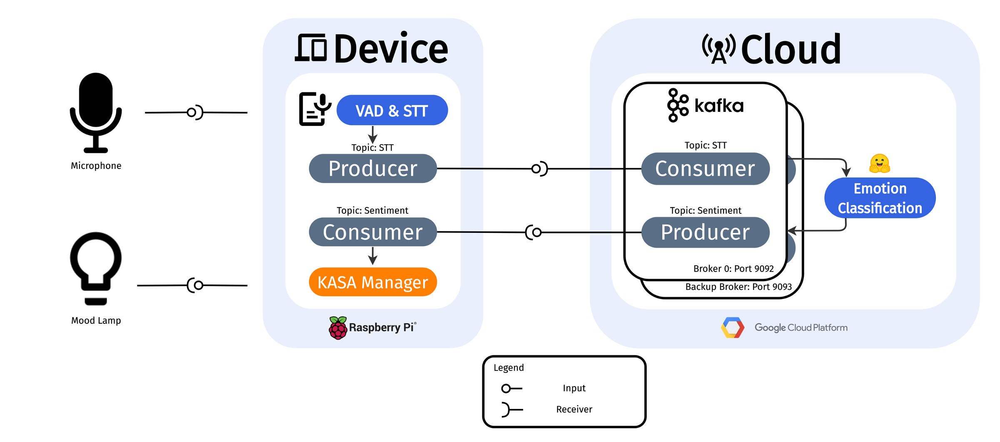

# Emotion-Based-automatic-stage-lighting

Welcome to the repository of team JH&L, who participated in the studio project at CMU.

Our project focuses on developing a demo-system that adjusts stage lighting based on emotion detection. To accomplish this, we have utilized two Raspberry Pi devices as our edge devices and the Google Cloud Platform as our server. Additionally, we are using KASA Smart light bulbs for the lighting system.



This repository consists of two main directories, and each of those directories operates separately on Raspberry Pi(`pi/`) and GCP(`gcp/`).

In our demo, we have an additional visualization of input level and VAD module. Code for this live visualization is in `demo/`.


## 0. Configuration

You can easily set configuration parameters such as the Kafka host IP address in `config.json`.


## 1. Edge Device: Raspberry Pi

To run a STT model with VAD, and send detected sentence through Kafka producer,
```
python pi/STT_kafka_producer.py -p ./config.json -i BULB_ID -m PATH_TO_DEEPSPEECH_MODEL -s PATH_TO_DEEPSPEECH_SCORER
```

To run a KASA light adjustment module by recieving detected emotion from server,
```
python pi/KASA_kafka_consumer.py -p ./config.json -i BULB_ID
```


## 2. Server: Google Cloud Platform

On GCP, you first need to setup Kafka environment and run zookeeper/broker. Detailed Kafka configuration on GCP can be found in `gcp/README.md`.

To run the emotion detection on GCP,
```
python gcp/get_stt.py
```

